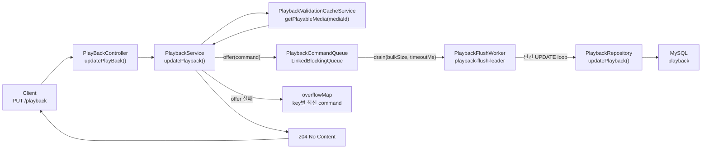
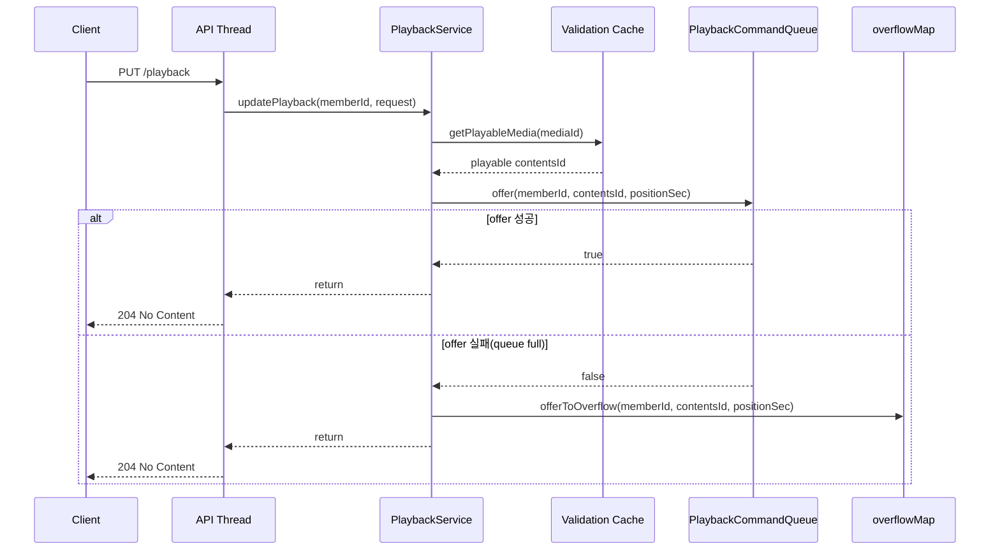
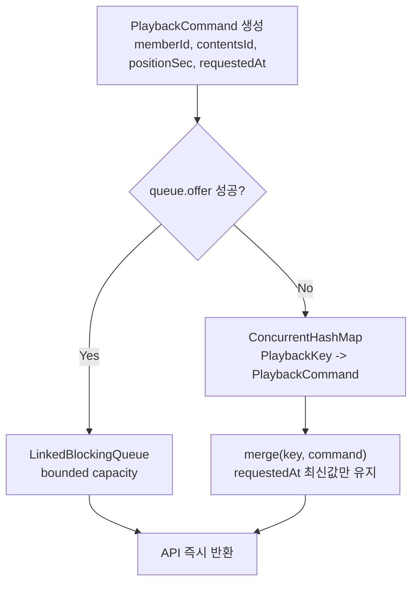
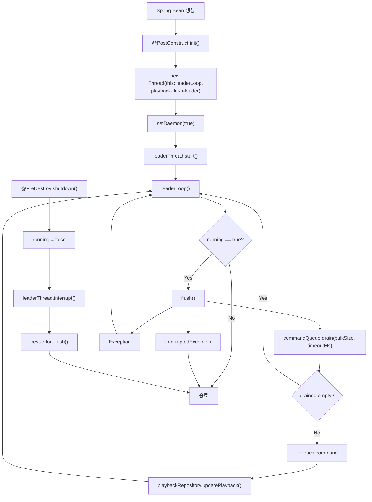
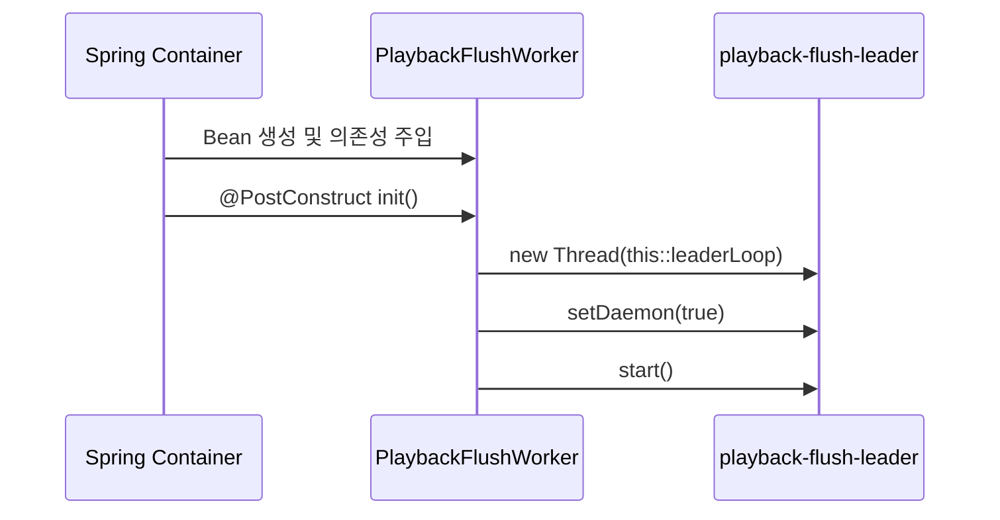
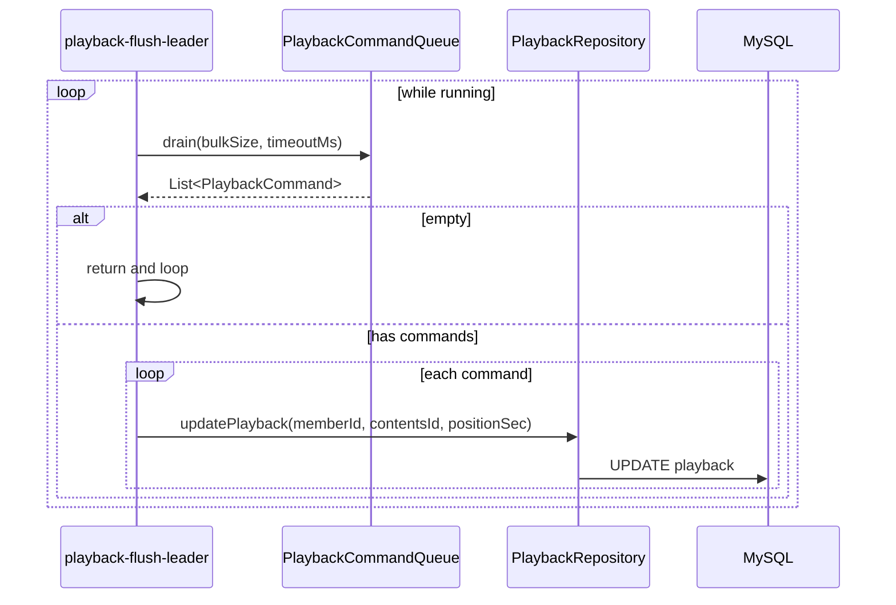
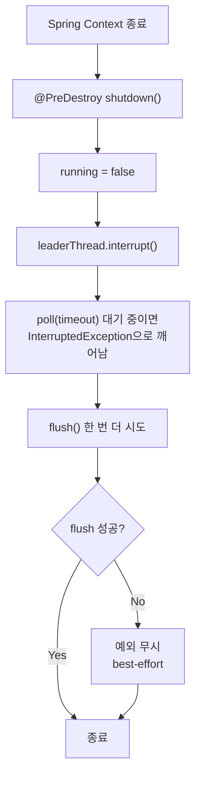
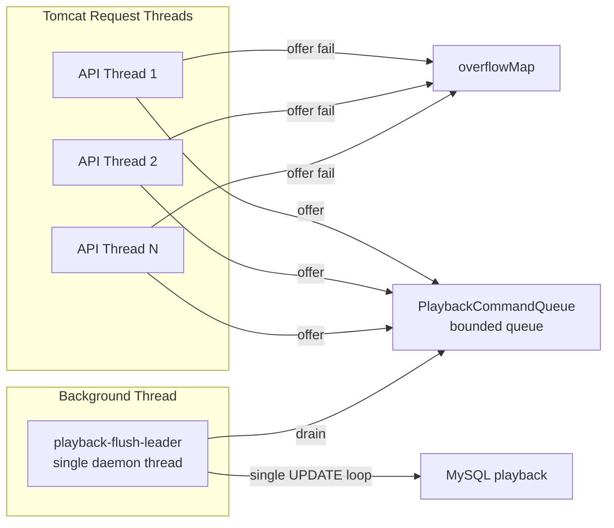
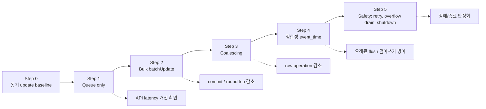
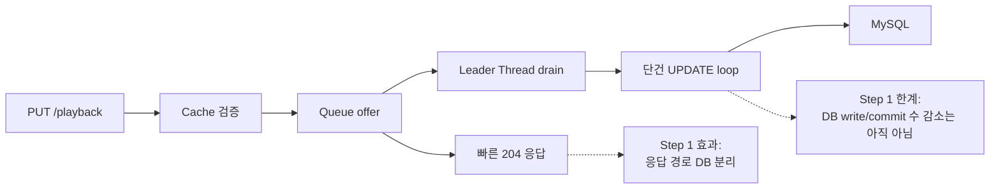

# Step 1 Diagram: Queue + Service 비동기 분리

## 0. 요약

이 문서는 `PUT /playback` Step 1 구현을 다이어그램 중심으로 정리한다.

Step 1의 목적은 DB write를 줄이는 것이 아니라, 먼저 API 요청 스레드와 DB write 경로를 분리하는 것이다.

| 항목 | 현재 Step 1 |
|------|-------------|
| 해결한 것 | API thread가 DB `UPDATE`와 commit 완료를 기다리지 않음 |
| 아직 남은 것 | Worker가 `updatePlayback()`을 단건 반복하므로 DB write 수와 commit 수는 아직 크게 줄지 않음 |
| Queue full 처리 | `overflowMap`에 같은 key의 최신 command만 보관 |
| Worker 방식 | `@PostConstruct`에서 시작한 단일 daemon leader thread |
| 다음 단계 | `JdbcTemplate.batchUpdate()` + `@Transactional` flush service |

---

## 1. Step 1 전체 흐름



핵심 변화는 `PlaybackService`가 더 이상 `playbackRepository.updatePlayback()`을 직접 호출하지 않는다는 점이다.

```text
Before:
  API thread -> DB UPDATE -> commit -> 204

After Step 1:
  API thread -> queue.offer -> 204
  background worker -> DB UPDATE
```

---

## 2. API Thread 흐름



### 왜 Service가 이렇게 바뀌었는가

| 선택 | 이유 | 단점 |
|------|------|------|
| `queue.offer()` | non-blocking이라 API thread가 queue full에서 대기하지 않음 | queue에 들어간 데이터는 아직 DB 반영 전 |
| `offerToOverflow()` | queue full이어도 최신 playback 위치를 key별로 보존 | 현재 Step 1 worker는 overflow를 아직 flush하지 않음 |
| 즉시 `204` | 재생 위치 저장 요청의 hot path latency를 DB와 분리 | flush 실패는 요청 응답에서 알 수 없음 |

---

## 3. Queue와 Overflow Map



`PlaybackCommandQueue`의 역할은 단순 저장소가 아니라 API thread와 worker thread 사이의 생산자-소비자 경계다.

| 구성 | 역할 |
|------|------|
| `LinkedBlockingQueue` | 정상 흐름에서 command를 순서대로 적재 |
| bounded capacity | 순간 부하를 무한히 메모리에 쌓지 않음 |
| `offer()` | queue full 시 API thread를 block하지 않고 `false` 반환 |
| `overflowMap` | queue full 시 같은 `(memberId, contentsId)`의 최신값만 유지 |
| `requestedAt` | overflow에서 어떤 command가 최신인지 비교하는 기준 |

현재 구현상 `drainOverflow()` 메서드는 존재하지만, Step 1의 `PlaybackFlushWorker.flush()`에서는 아직 호출하지 않는다. 이 부분은 Safety 단계에서 실제 flush pipeline에 연결해야 한다.

---

## 4. PlaybackFlushWorker 생명주기



### init이 왜 이렇게 구성됐는가



| 구성 | 이유 | 한계 |
|------|------|------|
| `@PostConstruct` | queue/repository 주입이 끝난 뒤 worker 시작 | 직접 thread lifecycle을 코드가 관리 |
| 전용 leader thread | queue를 계속 감시하고 flush를 반복해야 함 | Spring `TaskExecutor`/`TaskScheduler`를 쓰지 않음 |
| `daemon=true` | JVM 종료를 이 thread가 막지 않음 | 비정상 종료 시 남은 command flush 보장 없음 |
| `running` flag | shutdown에서 loop 종료 신호를 줄 수 있음 | interrupt와 함께 관리해야 함 |

Step 1에서는 구조를 빠르게 검증하기 위해 직접 thread를 사용했다. 최종 구조에서는 Spring 표준 실행 모델로 바꾸는 선택지도 다시 비교해야 한다.

---

## 5. flush 동작



현재 `flush()`는 Step 1용 최소 구현이다.

| 현재 동작 | 의미 |
|-----------|------|
| `drain()` | queue에서 최대 `bulkSize`만큼 가져옴 |
| 단건 `updatePlayback()` loop | command마다 DB update 수행 |
| 개별 try-catch | 한 command 실패가 나머지 command 처리를 막지 않음 |
| transaction 통합 없음 | commit 수 감소 효과는 아직 없음 |

따라서 Step 1의 측정 목적은 DB write 감소가 아니라 API 응답 경로 분리 효과를 보는 것이다.

---

## 6. shutdown 흐름



### shutdown이 왜 이렇게 구성됐는가

| 동작 | 이유 | 단점 |
|------|------|------|
| `running = false` | worker loop의 다음 반복을 막음 | 현재 실행 중인 update는 즉시 중단하지 않음 |
| `interrupt()` | `poll(timeout)` 대기를 즉시 깨움 | interrupt 처리 흐름을 정확히 관리해야 함 |
| 마지막 `flush()` | queue에 남은 command를 최대한 DB에 반영 | 실패 시 retryBuffer가 없어 유실 가능 |
| 예외 무시 | 종료를 무기한 지연하지 않음 | shutdown flush 성공 여부 관측이 약함 |

현재 shutdown은 "가능하면 비운다"는 best-effort다. 결제/주문처럼 유실 불가 데이터에는 부족하지만, playback 위치는 짧은 flush interval 수준의 유실을 허용할 수 있어 Step 1에서는 수용 가능한 실험 구조다.

---

## 7. Thread 관계



| 스레드 | 역할 | DB 접근 |
|--------|------|---------|
| API request thread | cache 검증 후 queue에 command 적재 | 없음 |
| `playback-flush-leader` | queue에서 command를 가져와 DB update 수행 | 있음 |
| DB connection | worker의 update 요청 처리 | worker를 통해서만 사용 |

Step 1의 핵심은 많은 API thread가 DB connection을 직접 잡지 않게 만든 것이다. DB write는 단일 background thread로 이동한다.

---

## 8. Step 1의 현재 위치



| 단계 | 줄이는 것 | 현재 상태 |
|------|-----------|-----------|
| Step 1 Queue only | API thread의 DB 대기 | 구현됨 |
| Step 2 Bulk batchUpdate | round trip, commit, connection 점유 횟수 | 다음 단계 |
| Step 3 Coalescing | 같은 key의 중복 row operation | 다음 단계 |
| Step 4 event_time | multi-server/late flush 순서 역전 | 다음 단계 |
| Step 5 Safety | overflow flush, retry, shutdown 안정화 | 다음 단계 |

---

## 9. 한 장 요약



Step 1은 최종 개선이 아니라 실험의 첫 단위다.

정확한 메시지는 아래다.

```text
Queue only는 DB write를 줄인 것이 아니라,
DB write를 API 응답 경로 밖으로 이동시킨 단계다.
```

따라서 Step 1 측정에서는 다음을 분리해서 봐야 한다.

| 지표 | 확인할 것 |
|------|-----------|
| API latency | 요청이 DB commit 대기에서 벗어났는지 |
| error rate/check pass | queue 도입 후 timeout이 줄었는지 |
| queue depth | worker가 소비를 따라가는지 |
| DB update rate | 아직 write 수가 줄지 않았다는 한계 확인 |
| worker error log | 단건 update 실패가 누적되는지 |

