# Step 2 Diagram: Bulk Update

## 0. 요약

이 문서는 `PUT /playback` Step 2 구현을 다이어그램 중심으로 정리한다.

Step 2의 목적은 Step 1에서 분리한 background write 경로를 단건 `UPDATE` 반복에서 `JdbcTemplate.batchUpdate()` 기반 batch 처리로 바꾸는 것이다.

중요한 구분은 아래와 같다.

```text
Step 2는 "진짜 SQL 한 방"이 아니다.
UPDATE N개를 JDBC batch로 묶어 보내고,
트랜잭션 commit을 1번으로 줄이는 단계다.
```

| 항목 | Step 1 | Step 2 |
|------|--------|--------|
| Worker DB 호출 | `updatePlayback()` 단건 반복 | `batchRepository.batchUpdate(drained)` |
| SQL 실행 | UPDATE N개 | UPDATE N개 |
| commit | N번에 가까움 | 1번 |
| round trip | 단건 호출 반복 | JDBC batch 전송 |
| key 정렬 | 없음 | `memberId`, `contentsId` 기준 정렬 |
| 아직 남은 것 | 중복 key 제거 없음 | 중복 key 제거 없음 |

---

## 1. Step 1 vs Step 2

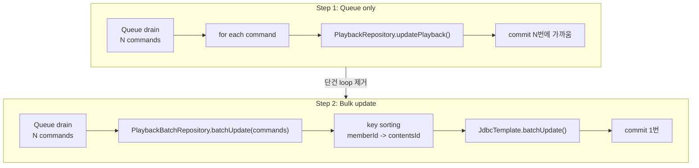

Step 2는 API thread 흐름을 바꾸지 않는다. 바뀐 곳은 `PlaybackFlushWorker` 뒤쪽의 DB 반영 방식이다.

---

## 2. Step 2 전체 흐름

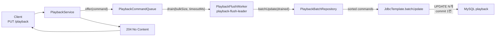

Step 1과 동일하게 API는 queue에 넣고 즉시 응답한다. Step 2의 개선 효과는 worker가 DB를 호출하는 방식에서 나온다.

---

## 3. FlushWorker 변경

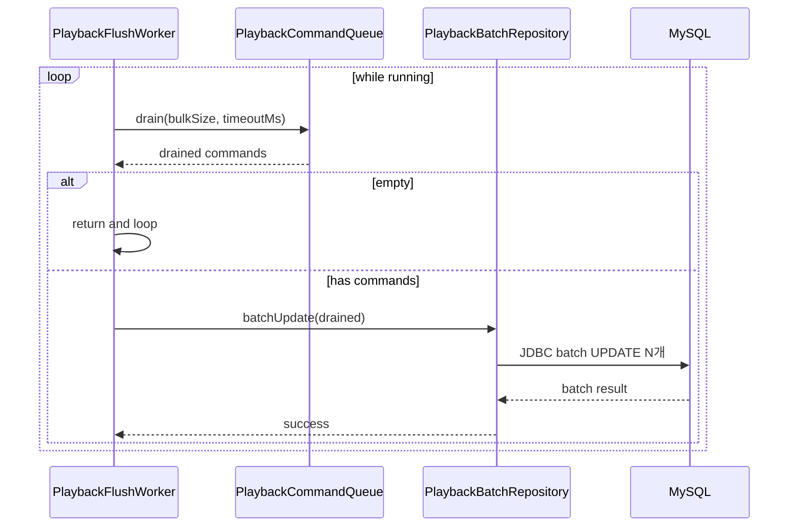

### 무엇이 바뀌었는가

| Step 1 | Step 2 |
|--------|--------|
| `PlaybackFlushWorker`가 `PlaybackRepository` 의존 | `PlaybackFlushWorker`가 `PlaybackBatchRepository` 의존 |
| command마다 `updatePlayback()` 호출 | drained batch 전체를 `batchUpdate()`로 전달 |
| command별 try-catch | batch 전체가 하나의 트랜잭션 단위 |
| 한 건 실패해도 다음 command 처리 가능 | 실패 시 batch 전체 rollback |

Step 2에서는 부분 성공을 의도하지 않는다. 실패 시 전체 batch를 실패로 보고, retryBuffer는 Step 5에서 다룬다.

---

## 4. PlaybackBatchRepository 내부 흐름

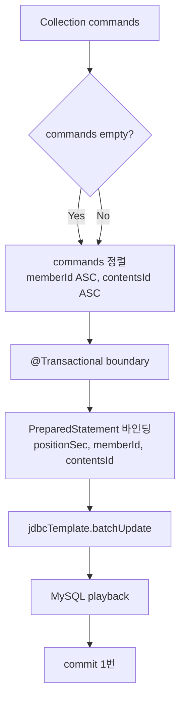

실제 SQL은 기존 `PlaybackRepository.updatePlayback()`와 같은 의미다.

```sql
UPDATE playback
SET position_sec = ?,
    modified_date = NOW()
WHERE member_id = ?
  AND contents_id = ?
  AND status = 'ACTIVE'
```

즉 Step 2는 business behavior를 바꾸지 않고 실행 단위만 바꾼다.

---

## 5. Transaction 위치

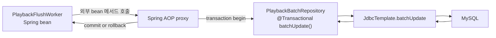

### 왜 FlushWorker가 아니라 BatchRepository에 붙었는가

| 선택지 | 문제 |
|--------|------|
| `PlaybackFlushWorker.flush()`에 `@Transactional` | worker 내부에서 `this.flush()`로 호출하므로 self-invocation 문제가 생김. 프록시를 타지 않음 |
| 별도 flush service | 원칙적으로는 더 깔끔하지만 Step 2에서는 클래스가 늘어남 |
| `TransactionTemplate` | 동작은 명확하지만 코드에 트랜잭션 API가 직접 노출됨 |
| `PlaybackBatchRepository.batchUpdate()` | worker가 다른 bean 메서드를 호출하므로 프록시를 타고 트랜잭션 적용 가능 |

일반 원칙으로는 트랜잭션은 서비스 계층에 두는 것이 더 낫다. 현재 Step 2에서는 실험 단계를 빠르게 닫기 위해 batch repository에 둔 임시 선택이다.

---

## 6. JDBC batchUpdate의 정확한 의미

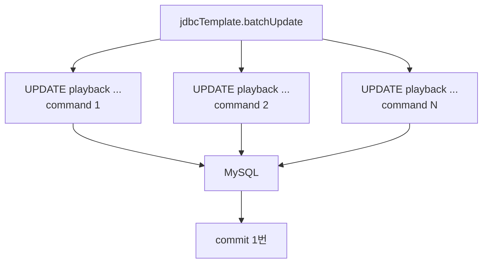

Step 2에서 줄이는 것과 줄이지 못하는 것은 분리해야 한다.

| 구분 | 판단 |
|------|------|
| 줄이는 것 | commit 횟수, connection 점유 횟수, worker와 DB 사이 호출 경계 |
| 일부 줄 수 있는 것 | 네트워크 왕복. 실제 효과는 JDBC driver 설정과 DB 동작에 의존 |
| 줄이지 못하는 것 | DB에서 실행되는 UPDATE row operation 수 |
| 아직 못 하는 것 | 같은 key의 중복 command 제거 |

따라서 Step 2 결과를 설명할 때는 "DB write가 N개에서 1개로 줄었다"라고 쓰면 안 된다.

정확한 표현은 아래다.

```text
UPDATE 문은 N개지만,
JDBC batch와 하나의 트랜잭션으로 묶어 commit 비용과 호출 경계를 줄였다.
```

---

## 7. Key Sorting과 Deadlock 방어

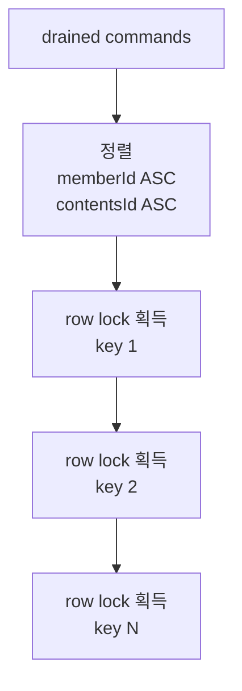

정렬하지 않으면 여러 worker나 여러 서버가 같은 row 집합을 다른 순서로 update할 때 교차 대기 가능성이 생긴다.

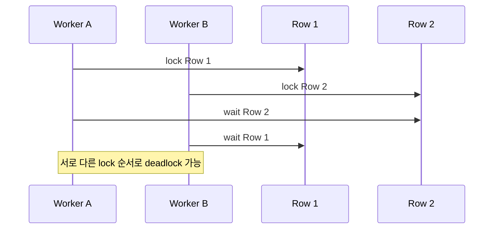

Step 2는 단일 worker라도 key sorting을 미리 넣었다. 이유는 다음 단계에서 worker 병렬화나 다중 서버 flush가 들어와도 lock 획득 순서를 통일하기 위해서다.

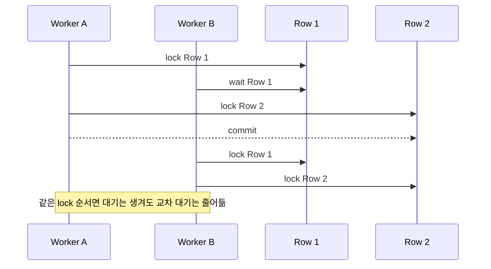

정렬은 deadlock 가능성을 낮추는 구조적 방어다. 다만 DB deadlock을 모든 상황에서 완전히 없앤다고 표현하면 과하다. 추후에는 deadlock retry도 별도로 고려해야 한다.

---

## 8. 실패 흐름

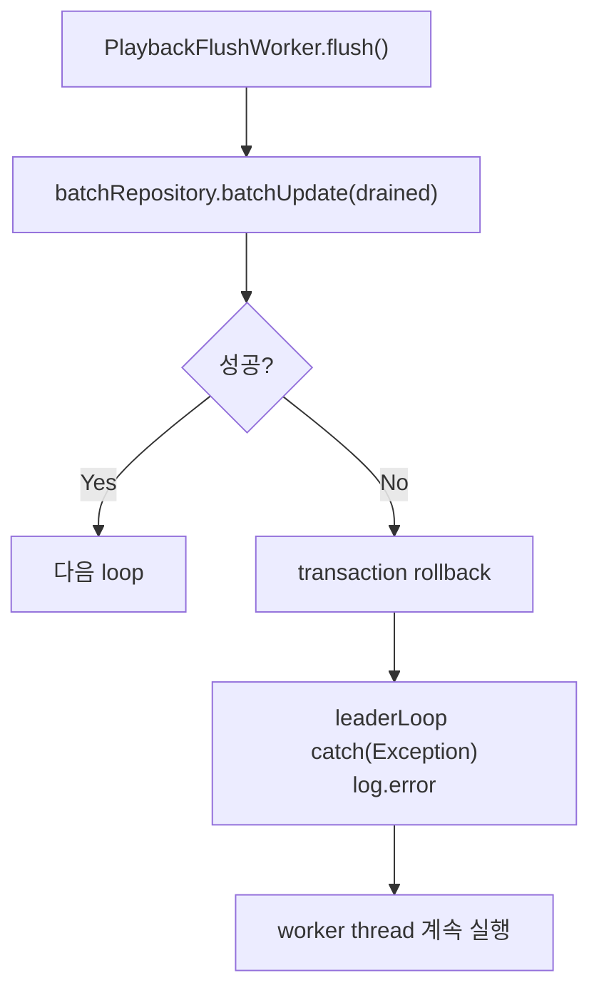

Step 2의 실패 정책은 단순하다.

| 항목 | 현재 Step 2 |
|------|-------------|
| batch 일부 실패 | 전체 rollback |
| 실패 command 보존 | 없음 |
| worker thread | 예외를 로그로 남기고 다음 loop 계속 |
| retry | Step 5에서 retryBuffer로 추가 예정 |

즉 Step 2는 성능 구조 확인 단계이며, 장애 안정화 단계는 아직 아니다.

---

## 9. Step 2의 현재 위치

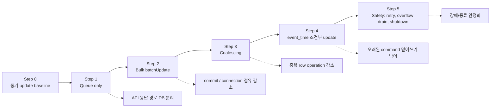

| 단계 | 줄이는 것 | 현재 상태 |
|------|-----------|-----------|
| Step 1 Queue only | API thread의 DB 대기 | 완료 |
| Step 2 Bulk batchUpdate | commit, round trip, connection 점유 횟수 | 현재 문서 |
| Step 3 Coalescing | 같은 key의 중복 row operation | 다음 단계 |
| Step 4 event_time | 순서 역전 | 다음 단계 |
| Step 5 Safety | 실패/종료/overflow 안정화 | 다음 단계 |

---

## 10. 한 장 요약

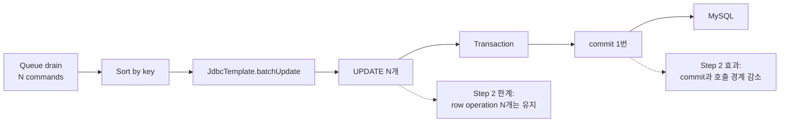

Step 2의 정확한 메시지는 아래다.

```text
Bulk는 row 수를 줄이는 단계가 아니다.
Bulk는 commit, connection 점유, 호출 경계를 줄이는 단계다.
row operation 감소는 Step 3 Coalescing의 역할이다.
```

따라서 Step 2 측정에서는 다음을 분리해서 봐야 한다.

| 지표 | 확인할 것 |
|------|-----------|
| API latency | Step 1 대비 유지 또는 개선되는지 |
| DB connection acquire/wait | worker batch 처리로 대기 압력이 낮아지는지 |
| commit 빈도 | 요청 수 대비 commit 수가 줄었는지 |
| DB update row count | 아직 command 수와 거의 같은지 |
| flush duration | batch 크기에 따라 flush가 얼마나 걸리는지 |
| error/check rate | batch rollback이 고부하에서 영향을 주는지 |

