# Step 4 Diagram: event_time 정합성

## 0. 요약

이 문서는 `PUT /playback` Step 4 구현을 다이어그램 중심으로 정리한다.

Step 4의 목적은 queue 기반 write-behind에서 오래된 command가 늦게 flush되어 최신 playback 위치를 덮어쓰는 문제를 DB 레벨에서 막는 것이다.

| 항목 | Step 4 |
|------|--------|
| 추가 컬럼 | `playback.event_time DATETIME(3) NOT NULL DEFAULT NOW()` |
| command 기준 시간 | `PlaybackCommand.requestedAt` |
| update 조건 | DB의 기존 `event_time`보다 command 시간이 최신일 때만 update |
| 막는 문제 | 다중 서버, retry, worker 다중화에서 늦게 도착한 오래된 write |
| 아직 남은 것 | retryBuffer, clock skew, 동일 millisecond 처리 정책 |

---

## 1. 왜 event_time이 필요한가

queue 기반 write-behind에서는 요청 순서와 DB 반영 순서가 항상 같다고 볼 수 없다.

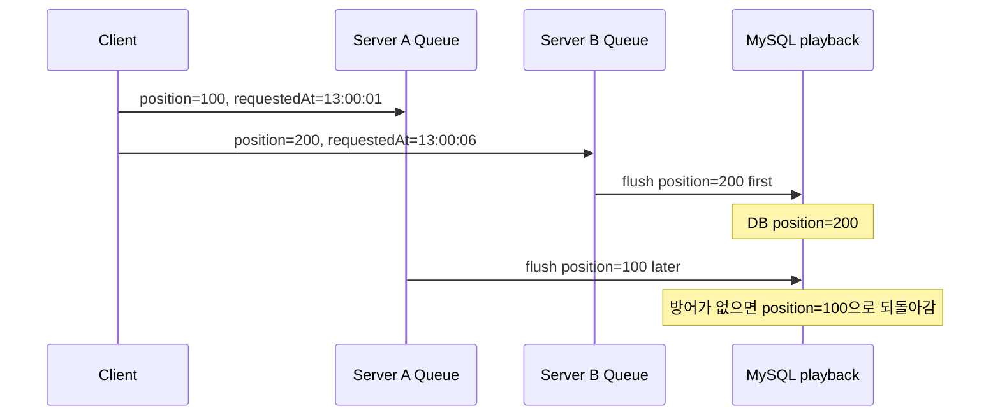

단일 서버, 단일 worker, 실패 없는 상황에서는 FIFO로도 충분할 수 있다. 하지만 다음 상황에서는 오래된 command가 나중에 DB에 도착할 수 있다.

| 상황 | 순서 역전 가능성 |
|------|------------------|
| 다중 서버 | 서버별 queue flush 순서가 다름 |
| retryBuffer | 실패 command가 나중에 재시도됨 |
| worker 다중화 | worker 간 batch commit 순서가 달라질 수 있음 |
| shutdown flush | 종료 시 남은 command가 뒤늦게 반영될 수 있음 |

---

## 2. Step 4 전체 흐름

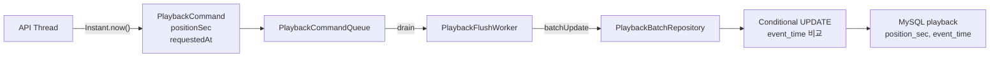

`requestedAt`은 API 요청 시점에 생성된다. Step 4에서는 이 값을 DB의 `event_time`과 비교하는 기준으로 쓴다.

---

## 3. DB 스키마와 init 흐름

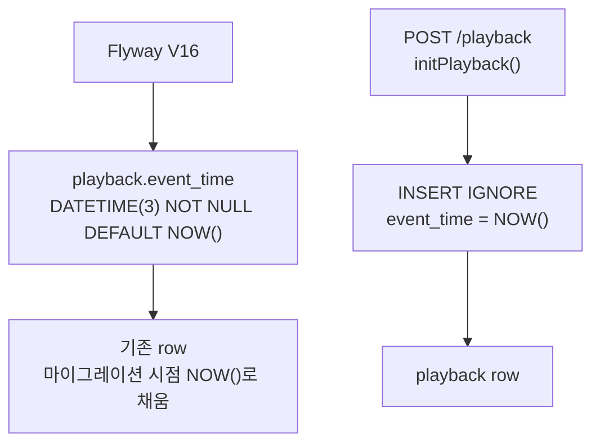

### 왜 NOT NULL + DEFAULT NOW()인가

| 선택 | 결과 |
|------|------|
| `event_time NULL 허용` | update 조건이 `event_time IS NULL OR event_time < ?`처럼 복잡해짐 |
| `NOT NULL + DEFAULT NOW()` | 모든 row가 비교 가능한 시간을 가지므로 `event_time < ?`만 쓰면 됨 |

`initPlayback()`도 `event_time = NOW()`를 넣는다. 이 덕분에 update SQL에서 NULL 예외 케이스를 다루지 않는다.

---

## 4. 조건부 UPDATE 흐름

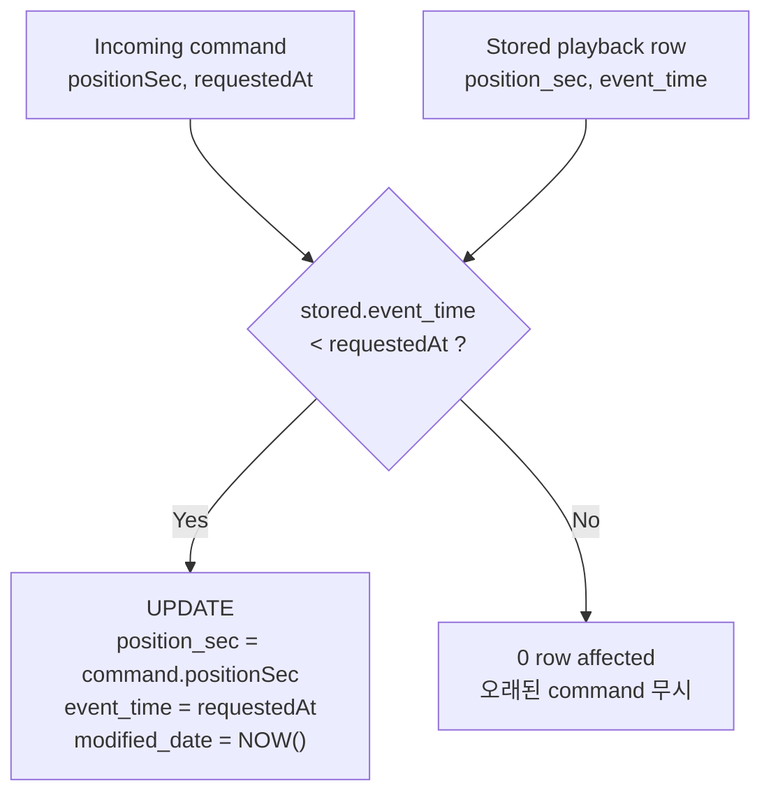

현재 SQL은 아래 방향이다.

```sql
UPDATE playback
SET position_sec = ?,
    modified_date = NOW(),
    event_time = ?
WHERE member_id = ?
  AND contents_id = ?
  AND status = 'ACTIVE'
  AND event_time < ?
```

같은 `requestedAt`을 두 번 쓴다.

| 바인딩 위치 | 값 |
|-------------|----|
| `SET event_time = ?` | `cmd.requestedAt()` |
| `AND event_time < ?` | `cmd.requestedAt()` |

---

## 5. 정상 순서와 역전 순서

### 정상 순서

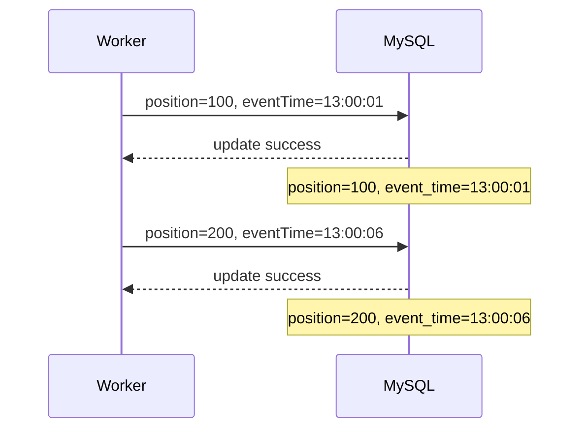

### 역전 도착

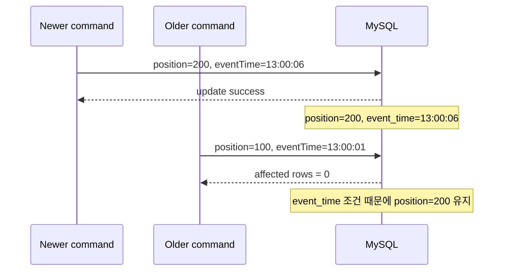

---

## 6. 다중 서버 방어

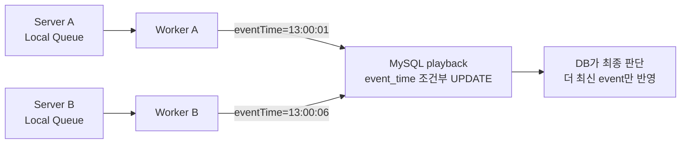

서버별 local sequence는 서로 비교할 수 없다. 그래서 Step 4는 JVM 내부 순서가 아니라 DB row의 `event_time`으로 최종 정합성을 방어한다.

| 기준 | 판단 |
|------|------|
| local sequence | 서버마다 값의 의미가 달라 다중 서버 비교 불가 |
| `positionSec` 크기 | 되감기 때문에 최신성 기준으로 부적합 |
| `requestedAt/event_time` | 서버 간 비교 가능한 시간 기준. 단, clock skew는 별도 고려 필요 |

---

## 7. retry와 shutdown에서의 의미

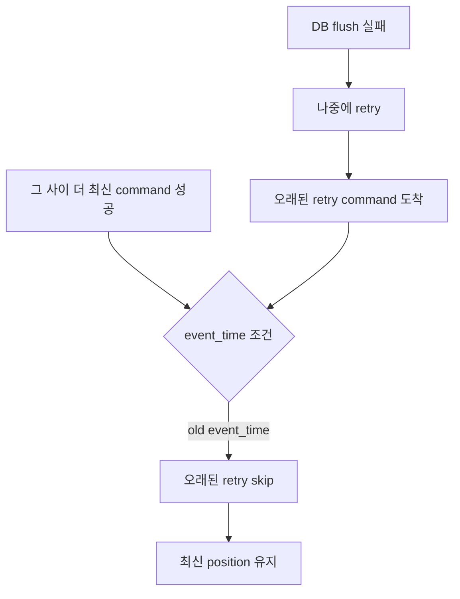

retryBuffer가 들어오면 실패 command가 나중에 다시 DB로 갈 수 있다. Step 4의 조건부 UPDATE는 이때도 오래된 retry가 최신값을 덮는 일을 막는다.

---

## 8. affected rows 해석

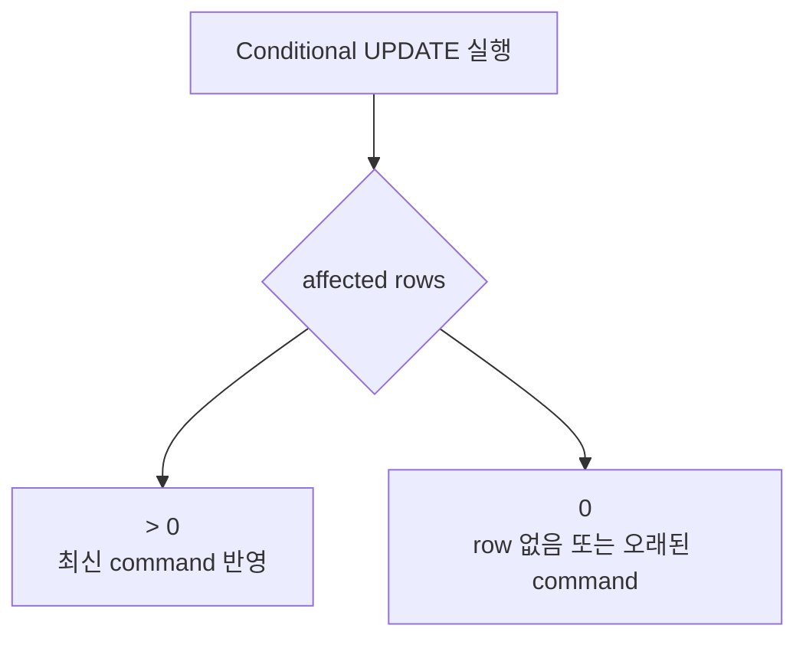

Step 4 이후 `affected rows = 0`은 실패만 의미하지 않는다.

| 원인 | 의미 |
|------|------|
| `(memberId, contentsId)` row 없음 | `/init`이 안 됐거나 status 조건 불일치 |
| `event_time`이 더 오래됨 | 의도적으로 stale command를 무시 |
| 동일 시각 | `event_time < ?` 조건이 false라 멱등 처리 |

따라서 Step 4 이후에는 affected row count를 볼 때 stale skip과 missing row를 분리해서 관측하는 것이 좋다.

---

## 9. 현재 Step 위치

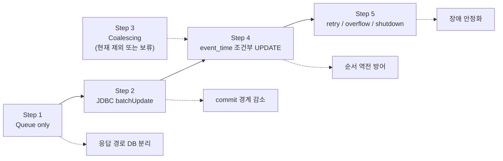

Step 4는 row operation 수를 줄이는 단계가 아니다. 오래된 write가 최신 write를 덮지 못하게 하는 정합성 단계다.

---

## 10. 한계와 주의점

| 한계 | 설명 |
|------|------|
| clock skew | 서버 시간이 어긋나면 `requestedAt` 비교가 왜곡될 수 있음 |
| 동일 millisecond | `DATETIME(3)`이라 같은 ms의 command는 뒤 command라도 skip될 수 있음 |
| affected row 0 해석 | stale skip과 missing row가 같은 0으로 보임 |
| 테스트 보강 필요 | 테스트 DB schema도 `event_time` 컬럼과 초기값을 반영해야 함 |
| DB write 수 감소 아님 | event_time은 정합성 방어이지 성능 최적화가 아님 |

---

## 11. 한 장 요약

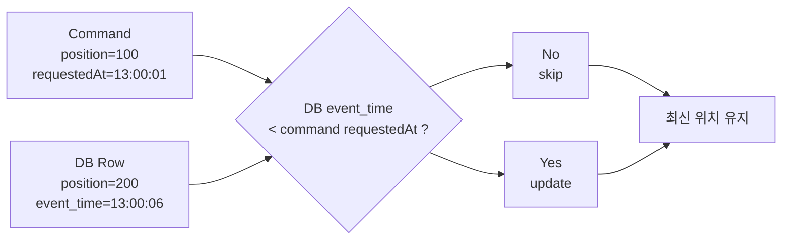

정확한 메시지는 아래다.

```text
Step 4는 더 빠르게 쓰기 위한 단계가 아니라,
늦게 도착한 오래된 write가 최신 playback 위치를 덮지 못하게 하는 단계다.
```

